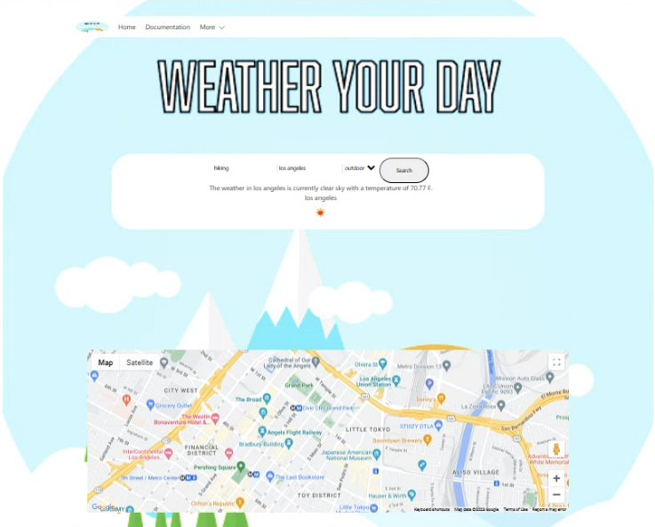

PROJECT 1- Weather Your Day!

## DESCRIPTION
This is an important step in your full-stack journey as you will now use your newly acquired skills and knowledge to build web application from scratch. With your team, you will conceive and execute a design that solves a real-world problem by integrating data received from multiple server-side API requests. Because you will be working collaboratively, you will learn agile development methodologies and implement feature and bug fixes using the git branch workflow and pull requests.

## USER STORY
As a user, I want to be able to search for an activity in a specific location to see where I can go to do said activity and get a weather update for that area

## PRESENTATION INSTRUCTIONS
Presentation Link:

Elevator pitch: A one-minute description of your application.

Concept: What is your user story? What was your motivation for development?

Process: What were the technologies used? How were tasks and roles broken down and assigned? What challenges did you encounter? What were your successes?

Directions for future development.

## PROJECT REQUIREMENTS
The user story and acceptance criteria will depend on the project that you create, but your project must fulfil the following requirements:

Use a CSS framework other than Bootstrap.

Be deployed to GitHub Pages.

Be interactive (i.e., accept and respond to user input).

Use at least two server-side APIs.

Does not use alerts, confirms, or prompts (use modals).

Use client-side storage to store persistent data.

Be responsive.

Have a polished UI.

Have a clean repository that meets quality coding standards (file structure, naming conventions, follows best practices for class/id naming conventions, indentation, quality comments, etc.).

Have a quality README (with unique name, description, technologies used, screenshot, and link to deployed application).

## Notes
Live link

Image Screen Shot:  